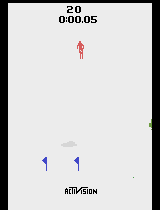
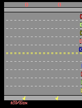
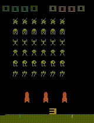
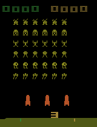

# EvoAtari: Benchmarking Bio-Inspired Agents across Atari Games

**Bio-Inspired Artificial Intelligence - Final Project (2025/2026)**  
**University of Trento**

**Authors:**
- Tommaso Ballarini
- Chiara Belli
- Elisa Negrini

---

## Overview

This project presents a benchmark comparing two distinct evolutionary paradigms applied to the Atari 2600 Arcade Learning Environment (ALE):

1.  **Structural Neuroevolution (NEAT):** Evolving neural network topologies to create efficient but opaque "Black-Box" agents.
2.  **LLM-Driven Code Evolution (OpenEvolve):** Leveraging Large Language Models (**Qwen2.5-Coder-7B**) to evolve executable, interpretable "White-Box" Python code.

Instead of relying on raw pixel inputs, which often lead to the "curse of dimensionality", our approach utilizes **Object-Centric State Representations** via the **OCAtari** library. By extracting semantic features (RAM Extraction Method) and applying custom **Fitness Shaping wrappers**, we enable bio-inspired agents to master complex tasks with significantly reduced computational overhead compared to Deep Reinforcement Learning (DRL).

###  Key Objectives
* **State Representation & Efficiency:** Demonstrate how semantic wrappers are fundamental architectural requirements when operating under deliberate computational constraints, enabling effective learning where raw-pixel approaches fail due to excessive dimensionality.
* **Interpretability vs. Performance:** Analyze the trade-off between the raw scores of neural networks and the transparency of code-based agents.

### Evaluated Environments
We test these approaches on three environments chosen for their distinct evolutionary challenges:
* **Skiing:** Sparse rewards and delayed credit assignment.
* **Freeway:** Synchronization, sparse reward and local optima avoidance.
* **Space Invaders:** Dynamic complexity and multi-object management

---

## Results Preview

### Skiing
The best FFNN Dynamic agent successfully navigates all gates with human-competitive completion times (~48 seconds), while the OpenEvolve agent finds an even more efficient path.

<table width="100%">
  <tr>
    <th width="50%">NEAT Agent (FFNN Dynamic)</th>
    <th width="50%">OpenEvolve Agent (Gen 1500)</th>
  </tr>
  <tr>
    <td></td>
    <td></td>
  </tr>
</table>

### Freeway
The best FFNN (wrapper + shaped fitness) agent learns rhythmic timing patterns to cross ten lanes. Comparison shows NEAT's frame-perfect reactivity vs OpenEvolve's conservative strategy.

<table width="100%">
  <tr>
    <th width="50%">NEAT Agent (FFNN Wrapper)</th>
    <th width="50%">OpenEvolve Agent (Conservative)</th>
  </tr>
  <tr>
    <td></td>
    <td></td>
  </tr>
</table>

### Space Invaders
The Egocentric RNN agent demonstrates emergent target prioritization (UFO sniping), while the OpenEvolve agent shows robust generalized behavior across random seeds.

<table width="100%">
  <tr>
    <th width="50%">NEAT Agent (Egocentric RNN)</th>
    <th width="50%">OpenEvolve Agent (Generalist)</th>
  </tr>
  <tr>
    <td></td>
    <td></td>
  </tr>
</table>


---
## Repository Structure
```

BIO-INSPIRED/
├── Neat/                                    # NEAT-based evolutionary experiments
│   ├── Skiing/
│   │   ├── wrapper/                         # Custom environment wrappers
│   │   │   ├── ...
│   │   ├── config/                          # NEAT configuration files
│   │   │   ├── ...
│   │   ├── run/                             # Training scripts
│   │   │   ├── ...
│   │   ├── visualize/                       # Visualization scripts
│   │   │   ├── ...
│   │   └── results/                         # Saved agents and plots
│   │       ├── ...
│   │
│   ├── Freeway/                             # Same structure as for Skiing
│   │   ├── ...
│   │
│   └── SpaceInvaders/                       # Same structure as for Skiing
│       ├── ...
│
├── OpenEvolve/                              # LLM-driven evolutionary experiments
│   ├── Skiing/
│   │   ├── wrapper/
│   │   ├── config/
│   │   └── results/
│   │
│   ├── Freeway/                             # Same structure as for Skiing in OPENEVOLVE
│   │   ├── ...
│   │
│   └── SpaceInvaders/                       # Same structure as for Skiing in OPENEVOLVE
│       ├── ...
│
├── human_benchmarks/                        # Scripts and results for human benchmark assessments
│   └── ...
├── report/                                  # IEEE format project report
│   └── EvoAtari_Report.pdf
│
├── requirements.txt                         # Python dependencies
├── assets/                                  # Games GIFs
└── README.md                                # This file
```

The tree above shows the two main experiment tracks (`Neat/` and `OpenEvolve/`), each organized per game with the same subfolders: wrappers for feature extraction, configs for NEAT hyperparameters, run scripts for training, visualization utilities, and results for saved models and plots. The root also includes the paper report and a shared `requirements.txt` so the environment is consistent across both tracks.

---

## Setup Instructions

### Prerequisites

- **Python**: 3.8 or higher
- **Operating System**: Linux/macOS (recommended), Windows (with WSL)
- **Hardware**: Multi-core CPU recommended for parallel evolution

### Installation

1. **Clone the repository**
```bash
   git clone https://github.com/tommaso-ballarini/BIO-INSPIRED.git
   cd BIO-INSPIRED
```

2. **Create a virtual environment** (recommended)
```bash
   python -m venv venv
   source venv/bin/activate  # On Windows: venv\Scripts\activate
```

3. **Install dependencies**
```bash
   pip install -r requirements.txt
```

### Required Libraries

- `gymnasium[atari]` - Atari 2600 environments
- `ale-py` - Arcade Learning Environment
- `neat-python` - NEAT implementation
- `ocatari` - Object-centric Atari wrapper
- `numpy` - Numerical computations
- `matplotlib` - Visualization
- `opencv-python` - Video rendering (optional)


---

## Methodology

To overcome the computational limitations inherent to raw pixel processing,  this study adopts a **semantic state extraction**. The idea is that for bio-inspired algorithms to succeed in limited compute environments, the "curse of dimensionality" must be solved architecturally, not just computationally.

### 1. Object-Centric Wrappers (OCAtari)
We utilize the **OCAtari** library to perform RAM Extraction Methods (REM). This transforms the 128-byte Atari RAM into compact, normalized feature vectors.

### 2. Game-Specific Strategies

To bridge the gap between sparse native rewards and evolutionary search, we designed custom **Fitness Shaping Functions** for each environment.

────────────────────────────────────────────────────────
#### 🎿 Skiing (Sparse Rewards)
**State Representation (9 Inputs)**:
* **Player Dynamics (3 inputs):** The agent's normalized horizontal position, ski orientation, and horizontal velocity ($x - x_{prev}$).
* **Target Navigation (3 inputs):** Guidance towards the next gate via lateral offset to the gate center, vertical proximity, and a binary gate detection flag.
* **Obstacle Awareness (3 inputs):** Relative $(x, y)$ coordinates of the nearest threat (tree or flag) and a categorical indicator distinguishing the type of obstacle.

**Fitness Function:**
    $$F = \sum_{t=0}^{T} (R_{gate} + R_{magnet} - P_{collision} - P_{boundary} - P_{time})$$
  
Where:
  
  &nbsp;- **$R_{gate}$**: Reward for successful gate passages 
  
  &nbsp;- **$S_{magnet}$**: Dense alignment gradient rewarding horizontal synchronization with the nearest target 
  
  &nbsp;- **$P_{collision}$**: Penalty for collision with any obstacle
  
  &nbsp;- **$P_{boundary}$**: Penalty track boundary violations

  &nbsp;- **$P_{time}$**: Penalty time to discourage stagnation

────────────────────────────────────────────────────────
#### 🐔 Freeway (Synchronization)
**State Representation (22 Inputs)**:
* **Agent State (2 inputs):** Normalized vertical position ($y_{norm}$) and a binary collision flag.
* **Traffic State (10 inputs):** Horizontal positions ($x$) of the cars in each of the ten lanes, normalized to screen width.
* **Temporal Dynamics (10 inputs):** Computed velocities ($\Delta x$) for each car. This allows the network to perceive motion and direction without requiring frame-stacking or recurrent memory.

**Fitness Function:**
    $$F = \sum_{t=0}^{T} (R_{crossing} + R_{ymax} - P_{collision} - P_{time})$$

  Where:
  
  
  &nbsp;- **$R_{crossing}$**: Reward for the number of successful crossings.
    
  &nbsp;- **$R_{ymax}$**: Dense reward for the maximum normalized vertical progress achieved in the current attempt (provided even if no crossing is completed).
    
  &nbsp;- **$P_{collision}$**: Penalty inferred on the total count of collisions.
    
  &nbsp;- **$P_{timepenalty}$**: Penalty given for the total number of elapsed frames.


────────────────────────────────────────────────────────
#### 👾 Space Invaders (Dynamic Complexity)
**State Representation (19 Inputs)**:
* **Player Position (1 input):** Recalibrated normalized horizontal coordinate ($P_x$) within the playable area.
* **Threat Sensors (10 inputs):** 5 vertical ray-casting sensors detecting the nearest projectile in each sector, plus 5 temporal deltas to infer projectile velocity.
* **Targeting & Strategy (5 inputs):** Normalized relative horizontal distance to the nearest bottom-row alien ($x_{alien} - P_x$) and the enemy count across four quadrants.
* **Game State (3 inputs):** Tracks global game progression (alien fraction), UFO position, and UFO availability.
  
**Fitness Function:**
    $$F = \sum_{t=0}^{T} (R_{kill} + R_{aim} - P_{danger} - P_{spam})$$
    
Where:

  &nbsp;- **$R_{kill}$**: Weighted bonus for alien elimination.
  
   &nbsp;- **$R_{aim}$**: Dense alignment gradient rewarding horizontal synchronization with the nearest target.
    
   &nbsp;- **$P_{danger}$**: Penalty for projectile proximity that scales as threats approach the player.
    
   &nbsp;- **$P_{spam}$**: Penalty for firing cooldown abuse to discourage random shooting.


---

##  Experimental Results: NEAT

The effectiveness of structural neuroevolution was evaluated across the three environments. The tables below compare the baseline (Raw RAM, standard fitness) against the Object-Centric (Wrapper) agents.

### 1. Skiing
*Challenge: Sparse rewards and delayed credit assignment.*

Since the native Atari score represents negative elapsed time, early termination can paradoxically yield higher values than slow completion. To ensure meaningful comparisons, the table below reports raw scores **conditioned on successful gate completion** (custom fitness > 9700), with the exception of the baseline (*), whose results reflect unconditional metrics. The 'Best Score' corresponds to the episode achieving the highest shaped fitness value, while 'n' indicates the number of successful runs (out of 100 evaluation episodes).

| Configuration | Best Score | Avg Score | Notes |
| :--- | :--- | :--- | :--- |
| **Baseline** (Raw RAM) | -6528.0 | -6401.64 (±718.51) | Failed. Agent descends straight down to minimize time (local minima). |
| **Wrapper + FFNN** (n=100) | -5248.0 | -5581 (±136) | Successful gate completion but conservative speed. |
| **Wrapper + RNN** (n=36) | -7152.0 | -7844 (±522) | High variance; memory didn't help with static obstacles. |
| **Wrapper + FFNN (Dyn)** (n=35) | **-4886.0** | **-5391 (±335)** | **Best Agent.** Dynamic time penalty forced faster descent. |
| *Human Benchmark* | *-3341.0* | *-3628 (±234)* | *Expert-level path planning.* |

> **Key Insight:** The "Dynamic" fitness variant was crucial. By progressively increasing the time penalty only *after* the agent learned to hit gates, we prevented the "reckless skiing" local minimum.

────────────────────────────────────────────────────────
### 2. Freeway
*Challenge: Synchronization and local optima.*

| Configuration | Best Score | Avg Score | Notes |
| :--- | :--- | :--- | :--- |
| **Baseline** | 20.0 | 17.07 (±1.12) | Stuck in collision-recovery loops ("deadlocks"). |
| **Wrapper + FFNN** | 21.0 | 19.51 (±0.94) | Better stability but lacked global timing. |
| **Wrapper + FFNN + Fit** | **29.0** | **25.06 (±1.57)** | **Near Optimal.** Learned to exploit gaps frame-perfectly. |
| **Wrapper + RNN** | 28.0 | 24.90 (±1.52) | Effective, but recurrent memory proved unnecessary. |
| **Wrapper + RNN + Fit** | 28.0 | 23.92 (±1.73) | Fitness shaping did not improve the recurrent model. |
| *Human Benchmark* | *31.0* | *25.76 (±4.13)* | *Higher peak score, but lower consistency than best agent.* |

> **Key Insight:** The continuous fitness shaping ($R_{ymax}$) solved the deadlock issue. The FFNN outperformed the RNN, suggesting that with velocity inputs included in the wrapper, the task is Markovian (no memory needed).

────────────────────────────────────────────────────────────────────────────────────────────────────────────────
### 3. Space Invaders
*Challenge: Dynamic complexity and multi-agent tracking.*

| Configuration | Best Score | Avg Score | Notes |
| :--- | :--- | :--- | :--- |
| **Baseline** | 760.0 | 221 (±156) | Spamming Fire pattern |
| **Wr. Col + FFNN** | 760.0 | 233 (±154) | "Column" inputs were too high-dimensional. |
| **Wr. Col + RNN** | 830.0 | 249 (±162) | Memory helped slightly, but input dimension was too high. |
| **Wr. Ego + RNN** | 1050.0 | 304 (±149) | Egocentric view improved tracking immediately. |
| **Wr. Ego + RNN (ext)** | 1880.0 | 366 (±113) | Extended training budget (300 gens) yielded better results. |
| **Wr. Ego + RNN + Fit (ext)** | **2380.0** | **421 (±120)** | In the best seed learned to snipe the UFO. |
| *Human Benchmark* | *970.0* | *541.3 (±194)* | *Higher average score, but significanty lower peak.* |

> **Key Insight:** This was the only environment where **Recurrent Neural Networks (RNN)** were strictly necessary. The agent needed memory to track projectile trajectories that momentarily disappeared or moved between sensors.

---

##  OpenEvolve: LLM-Driven Code Evolution

To contrast with NEAT's "Black-Box" networks, **OpenEvolve** was applied, a framework that treats Large Language Models as mutation operators.

* **Model:** Qwen2.5-Coder-7B (via Ollama)
* **Method:** A "Meta-Genome" system prompt guides the LLM to write executable Python policies based on the same OCAtari wrappers and fitness formula used for NEAT.
* **Evolution:** Both standard and cumulative strategies (where the best code from Generation $N$ is fed back as a few-shot example for Generation $N+1$) were used.

### Comparative Analysis: NEAT vs. OpenEvolve

The best "Black-Box" (NEAT) agents was benchmarked against the best "White-Box" (OpenEvolve) code.

| Environment | Metric | NEAT (Best Config) | OpenEvolve | 
|:-----------:|:------:|:------------------:|:----------:|
| **Skiing** | *Best Score* <br> *Avg Score* | -4886 <br> -5391.63 (±335) | **-3856** 🏆 <br> **-4004.96 (±86)** 🏆 | 
| **Freeway** | *Best Score* <br> *Avg Score* | **29.0** 🏆 <br> **25.06 (±1.57)** 🏆 | 18.0 <br> 15.28 (±1.43) | 
| **Space Inv.**| *Best Score* <br> *Avg Score* | **2380** 🏆 <br> 421 (±120) | 1495 <br> **517 (±212)** 🏆 | 

###  Discussion & Takeaways

1.  **Code vs. Neurons (Skiing):** OpenEvolve outperforms NEAT in Skiing. The LLM generated logical rules (e.g., *"If gate is to the left, move left immediately"*) which proved more efficient than the approximate function mapping of the neural network.
2.  **Reflex vs. Logic (Freeway):** NEAT dominated Freeway. The game requires frame-perfect reaction times ($~16ms$ precision) to weave through traffic. Neural networks excel at these reactive mappings, whereas the LLM-generated code adopted a "safety-first" if-else logic that was too conservative.
3.  **Generalization (Space Invaders):** While NEAT achieved the highest single-episode score (probable lucky seed), OpenEvolve had a higher **Average Score**. This suggests the code-based policy was more robust and generalized better to unseen starting states than the neural network.

## Conclusion

This project demonstrates that **Semantic State Representation** is the single most critical factor in evolving bio-inspired agents for Atari. By removing the pixel-processing burden:
1.  **NEAT** can master complex tasks on a standard laptop CPU.
2.  **LLMs** can evolve interpretable, human-readable Python strategies that rival neural networks.

----


## Contacts

For questions or collaboration inquiries:
- Tommaso Ballarini: [tommaso.ballarini@studenti.unitn.it]
- Chiara Belli: [chiara.belli@studenti.unitn.it]
- Elisa Negrini: [elisa.negrini@studenti.unitn.it]

